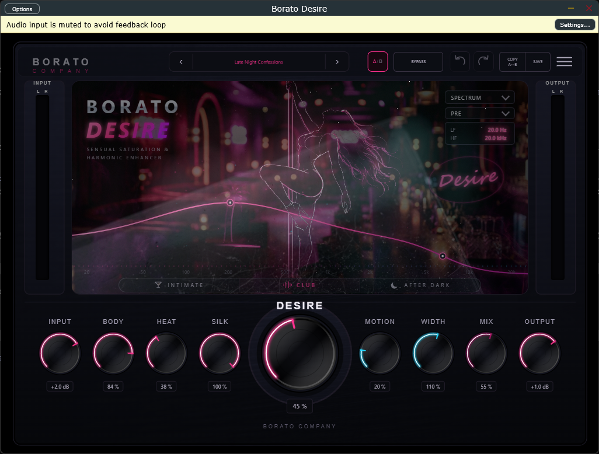

# Borato Desire



**Borato Desire** is a saturation/character audio plugin (VST3 + Standalone,
Windows) built with [JUCE](https://juce.com) and hosting its entire interface
in a **WebView2** browser embedded inside a native JUCE editor. The HTML/CSS/JS
you see when the plugin is open isn't a mockup — it's the actual shipped UI.

See [`MANUAL.md`](MANUAL.md) for the end-user guide (what each knob does,
presets, modes, the analyzer). This document is for people building or
modifying the plugin itself.

## Why WebView, and what that actually means

Most JUCE plugins draw their UI with `juce::Graphics` in C++. Borato Desire
instead renders `Prototype/index.html` (plus its CSS/JS/SVG) inside a
`juce::WebBrowserComponent`, using Microsoft WebView2 as the browser engine on
Windows. This buys a normal web dev workflow — CSS layout, SVG art, DOM
events — for a part of the product where that's a real advantage (a dense,
animated, brand-heavy display). It also means the project has two very
different technology stacks glued together at a specific, disciplined
boundary. Understanding that boundary is the single most important thing
before touching this codebase:

- **The audio thread never touches the browser.** `DesireAudioProcessor::processBlock`
  (`Source/PluginProcessor.cpp`) only ever reads atomics and pushes into
  lock-free buffers. It has no idea the WebView exists.
- **Parameters flow through JUCE's web relays**, not ad-hoc messaging:
  `WebSliderRelay` / `WebComboBoxRelay` / `WebToggleButtonRelay` on the C++
  side, paired with `...ParameterAttachment` objects that bind them to the
  `AudioProcessorValueTreeState`. The JavaScript side calls
  `juce.getSliderState("desire")` etc. (see `Prototype/scripts/bridge.js`) —
  there is exactly one source of truth for a parameter's value (the APVTS),
  never a second copy living in JS.
- **Everything else** (presets, A/B, undo/redo, the analyzer's on/off state)
  goes through `withNativeFunction` handlers registered in
  `Source/PluginEditor.cpp` — a small, explicit, named set of C++ functions
  the page can call, not a general "run this JS" or "read this file" escape
  hatch.
- **Metering and the spectrum are events, not shared memory.** The audio
  thread writes into atomics / an SPSC FIFO; a 30 Hz `juce::Timer` in the
  editor assembles a `desireVisualFrame` payload (peak/RMS, band energy, the
  FFT bins) and emits it as a JS event. The audio thread is never blocked
  waiting on the browser, and the browser never blocks the audio thread.
- **The web assets ship inside the plugin binary.** `plugin/CMakeLists.txt`
  stages `Prototype/` + the `Design/` assets it needs + `Assets/` into a
  folder, zips it, and embeds the zip as `BinaryData` via
  `juce_add_binary_data`. `PluginEditor.cpp` implements a `ResourceProvider`
  that serves files straight out of that embedded zip (with `..`-traversal
  rejected). **The plugin never touches the filesystem or the network at
  runtime** — there's no dev server, no "phone home," nothing to go stale.
- **If WebView2 isn't available, the plugin still works.** `BORATO_DESIRE_UI_BACKEND`
  (a CMake option: `WEBVIEW` / `NATIVE` / `AUTO`) controls this.
  `NativeEditorFallback` (`Source/NativeEditorFallback.*`) is a plain
  `juce::Graphics` editor with just Input/Desire/Mix/Output/Bypass/Mode — no
  visual parity with the WebView UI, just "the plugin is still controllable."
  In `AUTO` mode, if the page never calls the `reportUiReady` native function
  within 3 seconds of the editor opening, the plugin swaps to this fallback
  automatically. The DSP never depends on the editor existing at all — audio
  keeps processing with the editor closed, and closing it can't affect sound.

If you only remember one rule: **JavaScript renders things and reports user
gestures; it never computes, decides, or holds a value that C++ doesn't also
already have.**

## Project layout

```
Design/           Source of truth for visuals: tokens, static SVG/WebP layers,
                   juce-paint-specs (geometry contracts, mostly historical now
                   that the UI is WebView-hosted rather than juce::Graphics).
Prototype/         The actual shipped UI: index.html + styles/ + scripts/.
                   Also runs standalone in a browser with mocked data — see
                   "Working on the UI in a browser" below.
Assets/            Canonical source art (the dancer SVG).
Source/            The real C++: PluginProcessor, PluginEditor, DesireEngine
                   (DSP), SpectrumAnalyser, PresetManager, NativeEditorFallback.
                   Source/UI/*.cpp are dead stubs from an earlier
                   juce::Graphics-based plan; ignore them.
plugin/            plugin/CMakeLists.txt: juce_add_plugin, the WebView asset
                   staging/zip/BinaryData pipeline, target sources/links.
tests/             DesireEngineTests + PresetManagerTests (C++, CTest) and
                   graphics-mapping.test.js (Node's built-in test runner).
cmake/, scripts/   CPM bootstrap; scripts/DownloadWebView2.ps1 fetches the
                   WebView2 SDK automatically during CMake configure on
                   Windows -- you don't run this yourself.
.github/workflows/ CI: builds Windows/macOS/Ubuntu release artifacts.
```

## Building

Prerequisites: CMake ≥ 3.22, a C++20 compiler (MSVC on Windows), and — on
Windows — the WebView2 SDK gets fetched automatically at configure time
(needs internet access the first time; nothing to install by hand).

```powershell
# Configure (fetches JUCE 8.0.12 via CPM automatically)
cmake -S . -B build -G "Visual Studio 17 2022" -A x64

# Build the plugin
cmake --build build --config Release --target BoratoDesire_VST3 BoratoDesire_Standalone

# Build and run the test suites
cmake --build build --config Release --target DesireEngineTests PresetManagerTests
ctest --test-dir build -C Release --output-on-failure
node --test tests/graphics-mapping.test.js
```

If you have a local JUCE 8.0.12 checkout already and want to skip the CPM
fetch, pass `-DBORATO_DESIRE_JUCE_SOURCE=/path/to/juce`.

`BORATO_DESIRE_UI_BACKEND` defaults to `WEBVIEW`. Pass
`-DBORATO_DESIRE_UI_BACKEND=NATIVE` to build the diagnostic-only editor (no
WebView2 dependency at all), or `AUTO` for the WebView-with-fallback behavior
described above.

To actually use the built VST3, copy the bundle to
`C:\Program Files\Common Files\VST3\` (needs an elevated shell) and rescan
plugins in your DAW. The Standalone `.exe` needs no installation.

## Working on the UI in a browser

`Prototype/` runs outside the plugin too, with mocked parameter/meter/spectrum
data — useful for fast CSS/layout iteration without a full C++ rebuild.
`bridge.js` detects the absence of `window.__JUCE__` and switches to mocks
automatically, showing a small "BROWSER PREVIEW" badge so you can't confuse
the two. It references assets via `../Design/...` and `../Assets/...`, so
serve from the **repo root**, not from inside `Prototype/`:

```
python -m http.server 8000
# then open http://localhost:8000/Prototype/
```

(Opening `Prototype/index.html` directly via `file://` also works.) Whatever
you change here is exactly what ships — there's no separate "port it to C++"
step for the UI layer.

## Testing

- **`tests/DesireEngineTests.cpp`** — plain-assert C++ (no framework), built
  and run via CTest. Validates the DSP engine directly: silence-in/out,
  finite/bounded output across extreme parameter sweeps, bypass and mix=0
  passthrough behavior, mono-compatibility of the width stage, that Motion
  actually decorrelates L/R, zero heap allocation on the audio thread, and
  that the default preset doesn't push already-hot/mastered material into
  ceiling saturation.
- **`tests/PresetManagerTests.cpp`** — exercises `PresetManager` through the
  same `AudioProcessorValueTreeState → DesireEngine` path production code
  uses, via a minimal stand-in processor (avoids pulling in the WebView
  editor's binary-data dependency into a test binary).
- **`tests/graphics-mapping.test.js`** — Node's built-in `node:test`, zero
  dependencies. Validates the pure mapping functions in
  `Prototype/scripts/mapping.js` (knob value ↔ dB/percent/angle, the dB-scaled
  meter response, the Body/Silk response curve math, analyzer Hz ↔ normalized)
  that the knobs/meters/curve/analyzer UI all share.

Run everything:

```powershell
cmake --build build --config Release --target DesireEngineTests PresetManagerTests
ctest --test-dir build -C Release --output-on-failure
node --test tests/graphics-mapping.test.js
```

## Continuous integration

`.github/workflows/build-release-artifacts.yml` builds Windows (VST3 +
Standalone), macOS arm64/Intel (VST3 + AU, ad-hoc signed and validated with
`auval`), and Ubuntu (VST3, plus the full CTest suite — the DSP tests only run
once, on the cheapest runner) on every push to `master`/`release/**`/`ci/**`
and on `v*` tags, uploading artifacts and — for tags — attaching them to a
draft GitHub Release. The product version is read from the single
`project(BoratoDesire VERSION ...)` line in `CMakeLists.txt`, so cutting a
release is a one-line version bump plus a tag.

The macOS and Ubuntu jobs are unvalidated in the sense that no prior Borato
plugin has run a WebView-hosted JUCE editor through CI on those platforms —
Windows (where WebView2 is the whole point) is the one that's been proven
locally end-to-end, including a from-scratch CPM JUCE fetch.

## Architecture notes

`Design/` → `Prototype/` → `Source/` used to be a three-stage pipeline where
static art and geometry specs got hand-translated into `juce::Graphics` paint
code. That plan is superseded: the UI lives in `Prototype/` permanently now,
and `Design/juce-paint-specs/` is mostly historical. `Design/tokens` (colors,
spacing) still matters as the canonical source, mirrored into
`Prototype/styles/tokens.css`.

The DSP signal chain (`Source/DesireEngine.cpp`): input trim → low-shelf
"body" tone → drive (Desire × Heat-blended tanh/soft-knee waveshaper, with
Motion driving two phase-offset fractional delay lines rather than modulating
drive amplitude) → "silk" lowpass → mid/side width (with a safety soft-clip)
→ dry/wet mix (Bypass collapses this to 0, and ramps Output back to unity too
— not a hard switch) → output trim. Every parameter has its own smoothing
ramp time (20 ms for Input/Output/Mix up to 225 ms for Motion) rather than one
shared constant, specifically so a preset change reads as a transition, not a
reset.

## License

See [`LICENSE`](LICENSE).
